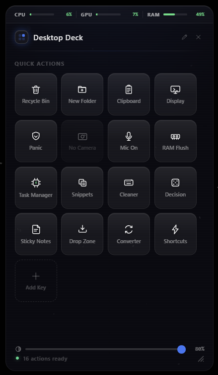
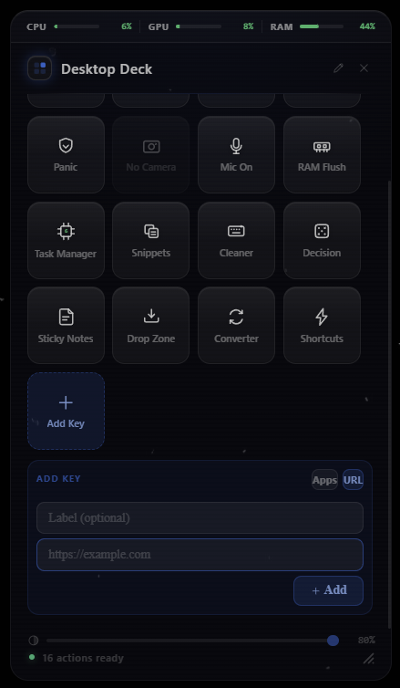
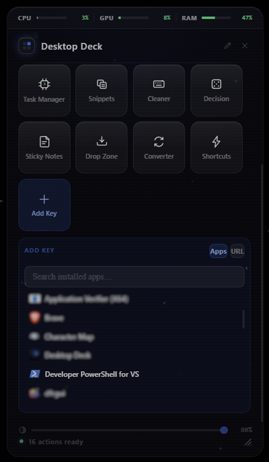
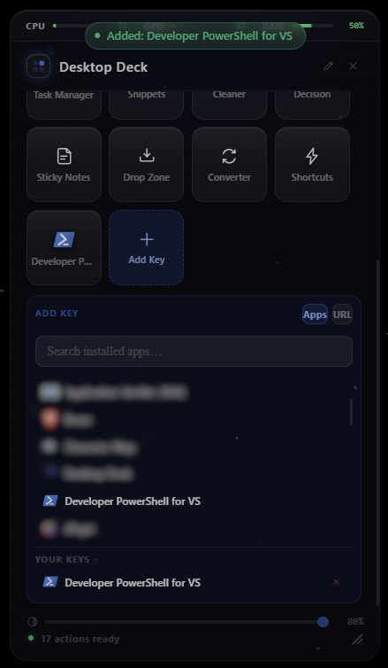
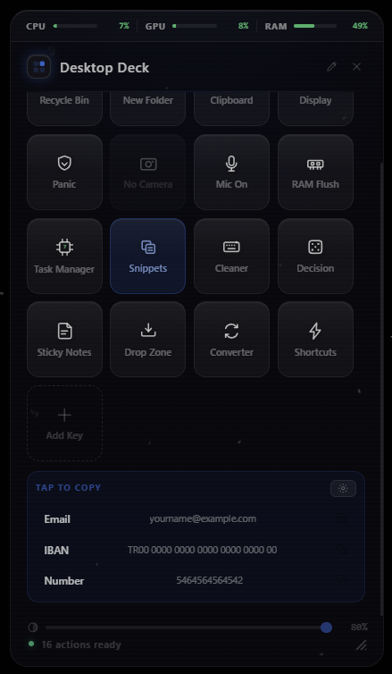
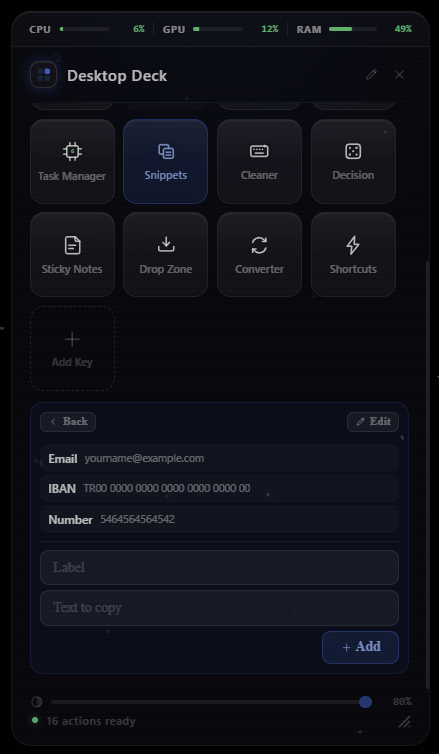
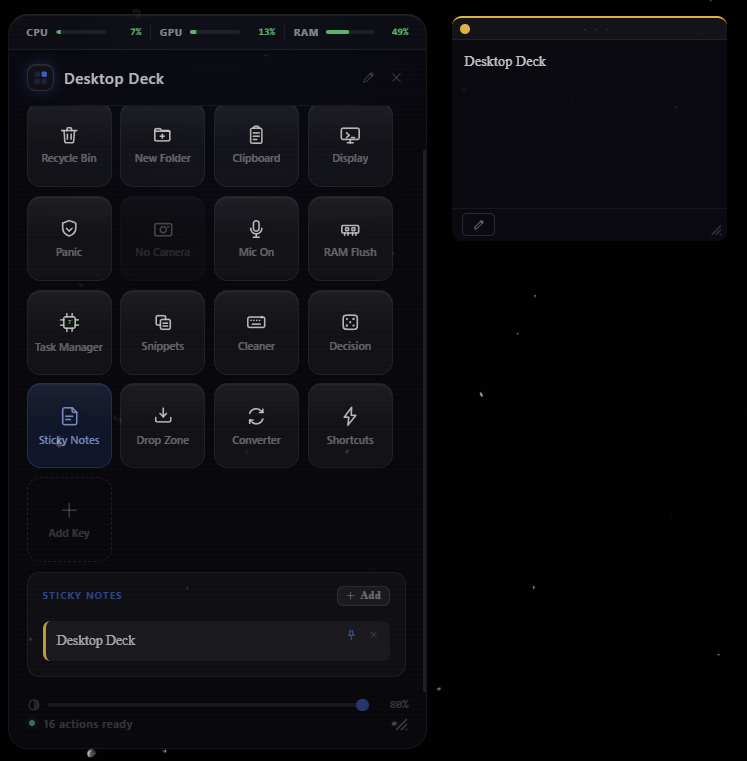

# Desktop Deck

> *Desktop Deck is a personal project, built and maintained by a single developer. Feedback and issues are welcome.*

A lightweight, always-on-desktop widget for Windows — inspired by Stream Deck. Quick-access keys for system tools, automations, and productivity modules, living permanently on your desktop without cluttering the taskbar.

Built with **Rust + Tauri v2** (backend) and **React + TypeScript** (frontend). Designed from the ground up to consume minimal CPU and RAM.

<p align="center">
  
</p>

---

## What it does

Desktop Deck sits on your desktop as a floating glass panel. It stays behind all open windows (never covers your work), becomes nearly invisible when you're not using it, and snaps back to full opacity the moment you hover over it. You can drag it anywhere on screen, resize it, and it remembers its position across reboots.

It gives you one-click access to the actions you reach for most — clearing RAM, emptying the recycle bin, blocking your mic or camera, projecting your display — without opening any menus or switching windows. A live instrument rail across the top reads out **CPU / GPU / RAM** usage, and you can pin your own apps and websites to the deck as custom keys.

---

## Design

The UI follows a custom **black-first design system**: translucent near-black glass panels with a single **cobalt blue (`#3b76f5`)** accent, hairline borders, and tactile keycaps that lift on hover and dip on press.

- **Custom monoline icon set** — every key uses a hand-built 24×24 icon (1.7&nbsp;px stroke, round caps), drawn in one coherent family. No emoji, no icon fonts. The full set lives in `src/Icon.tsx` (`ICON_PATHS`).
- **Live gauge colors** — CPU/GPU/RAM bars recolor by load: green ≤ 50%, amber 51–80%, red > 80%.
- **Dynamic icons** — the Task Manager key renders its live CPU percentage inside the chip glyph, recolored by load.
- **Brand app icon** — a 2×2 deck of keycaps with the top-right key lit cobalt, used for the installer, exe, and system tray (`src-tauri/icons/`).
- Design tokens (colors, typography, spacing, effects) live in `src/styles/tokens/`.

---

## Features

### Always-on-Desktop Behavior
- Pinned to the bottom of the Windows Z-order and attached to the desktop layer (`WorkerW`/`Progman`) — it never floats above your open applications
- Fullscreen applications (games, videos) cover it completely
- Touchpad gestures like **3-finger swipe down** (Show Desktop) do not minimize or disturb it
- Does **not** appear in the Windows taskbar — managed exclusively from the system tray

### System Monitor Rail
- Live **CPU**, **GPU**, and **RAM** usage bars across the top of the panel, updated every 2 seconds
- Bars and percentages recolor by load (green / amber / red)
- The rail doubles as a drag handle for moving the widget

### Transparency Mode
- **Idle:** adjustable opacity (default 25%, range 25–80%) — visible but non-intrusive
- **Hover:** 100% opacity — fully visible when you need it
- Adjust live via the slider above the status bar

### Drag, Resize & Position Memory
- Grab the **header bar** or the **monitor rail** to drag the widget anywhere on screen
- Drag the **bottom-right handle** to resize, between 350×580 and 640×960 logical pixels — widening the panel adds key columns, flowing from the top-left
- Position is saved automatically to `%APPDATA%\Desktop Deck\config.json` and restored on next launch

### Custom Deck Keys (Add Key)
- The dashed **Add Key** tile at the end of the grid pins your own shortcuts to the deck:
  - **Apps** — searches your Start Menu, lists installed applications, and extracts each app's real icon automatically
  - **URLs** — pins any website; the key picks up your default browser's icon
- Keys persist in `%APPDATA%\Desktop Deck\deck_keys.json` and launch their target with one click

### Edit Mode
- The **pencil button** in the header (next to ×) toggles edit mode:
  - **Click a key** to hide it from the deck or bring it back — hidden keys stay in the edit grid, dimmed with a dashed border and an eye-off badge
  - **Drag a key** to rearrange the grid (also works outside edit mode — hold and drag ~6&nbsp;px)
- Key order and hidden keys persist across restarts
- The status bar counts what's live: `16 actions ready · 1 hidden`

### System Tray Control
- Right-click the tray icon to access the menu:
  - **Show / Hide** — toggle widget visibility
  - **Quit** — quit the application (saves position before exit)

### Auto-Start with Windows
- Registers itself in the Windows startup registry on first run
- Launches silently in the background — no splash screen, no UAC prompt
- Can be disabled via **Task Manager → Startup Apps**

---

## Screenshots

<table>
<tr>
<td align="center"><br><sub>Add Key — pin an app or a URL</sub></td>
<td align="center"><br><sub>Search your installed apps</sub></td>
<td align="center"><br><sub>Pinned and ready to launch</sub></td>
</tr>
<tr>
<td align="center"><br><sub>Snippets — tap to copy</sub></td>
<td align="center"><br><sub>Manage snippets inline</sub></td>
<td align="center"><br><sub>Sticky note pinned to the desktop</sub></td>
</tr>
</table>

---

## Action Keys

The deck ships with 17 built-in keys plus your own pinned apps and URLs. Each key shows a monoline icon with a short label; hovering shows a one-line description in the info bar.

| Key | Icon (`Icon.tsx`) | Description |
|---|---|---|
| **Recycle Bin** | `recycle` | Empties the Windows Recycle Bin (with confirmation) |
| **New Folder** | `folder` | Creates a new empty folder on the Desktop instantly |
| **Clipboard** | `clipboard` | Wipes the entire Windows clipboard — useful after copying sensitive data |
| **Display** | `display` | Opens the Windows display projection panel (Win+P equivalent) |
| **Audio Out** | `speaker` | Switches the default audio output to the next device (headphones ↔ speakers) |
| **Panic** | `panic` | Minimizes all open windows and mutes system volume simultaneously |
| **Camera** | `camera` | OS-level camera kill-switch — blocks all apps; shows **No Camera** if no device exists |
| **Mic On / Mic Off** | `mic` | OS-level microphone kill-switch — the key turns red while blocked |
| **RAM Flush** | `ram` | Flushes working-set memory across processes to free up RAM |
| **Task Manager** | `cpu` (dynamic) | Live CPU % rendered inside the icon, recolored by load; click to open Task Manager |
| **Snippets** | `snippets` | Clipboard shortcuts for frequently typed text (IBAN, email, code blocks) |
| **Cleaner** | `cleaner` | Locks the keyboard for physical cleaning; click Stop or wait 60&nbsp;s to exit |
| **Decision** | `decision` | Flip a coin, roll a dice, or spin a customizable wheel |
| **Sticky Notes** | `sticky` | Floating notes pinned to the desktop — draggable, resizable, per-note opacity and font size |
| **Drop Zone** | `dropzone` | Temporary file staging area — drag files in, open, copy path, reveal in Explorer |
| **Converter** | `converter` | Converts images between PNG / JPG / WEBP / BMP in bulk |
| **Shortcuts** | `shortcuts` | Launches websites, apps, or Windows settings with one click |
| **Add Key** | `plus` | Pins an installed app or a website to the deck as a new key |

---

## Module Details

### Snippets
Define your own text snippets (IBAN, email addresses, code templates, etc.). Click a snippet to copy it to the clipboard instantly. Managed inline via the gear button; stored in `%APPDATA%\Desktop Deck\snippets.json`.

### Shortcuts
A drawer of one-click launchers: websites (`https://…`), executables, or Windows settings URIs (`ms-settings:…`). Add, edit, and remove them from the drawer's settings view. Stored in `%APPDATA%\Desktop Deck\shortcuts.json`.

### Decision Maker
Three modes accessible via tabs:
- **Coin** — flip a coin (Heads / Tails)
- **Dice** — roll a six-sided die with a spin animation
- **Wheel** — spin a customizable wheel with your own choices

### Sticky Notes
Create notes in up to 5 colors. Each note can be:
- **Pinned to the desktop** — opens a floating window that lives behind your apps, just like the main widget
- **Dragged** anywhere on screen
- **Resized** by dragging the bottom-right corner handle
- **Font size** adjustable per note (9–20 px)
- **Opacity** adjustable per note (25–100%)

Settings are accessed via the pencil button in the note footer. All settings are persisted per note in `%APPDATA%\Desktop Deck\notes.json`.

### Drop Zone
A file staging area inside the widget. Drag any file onto the panel while the Drop Zone drawer is open:
- **Open** — open the file with its default application
- **Show in Explorer** — highlight the file in Windows Explorer
- **Copy Path** — copy the full path to clipboard
- **Remove** — remove the file from the list (does not delete the file)

Files are kept in the list as long as the app is running (survive drawer open/close).

### Quick File Converter
Drag image files (PNG, JPG, JPEG, WEBP, BMP) onto the converter area. Pick a target format, click **Convert**, choose an output folder via the native Windows folder picker, and all files are converted in one go. Conversion is done entirely in Rust via the `image` crate — no external tools required.

### Mic / Camera Kill-Switch
Privacy toggles backed by the Windows consent store (OS-level, not per-app). Blocking writes both the system-wide and desktop-app (`NonPackaged`) consent values, so while blocked, **no application** — Store or classic desktop — can access the device. The key shows the live state — polled every 4 seconds — and turns red when blocked. If no device exists, the key is disabled and labeled `No Camera` / `No Mic`.

---

## Tech Stack

| Layer | Technology | Version |
|---|---|---|
| Backend runtime | Rust | stable (2021 edition) |
| Desktop framework | Tauri | v2 |
| Frontend library | React | 18 |
| Language | TypeScript | 5 |
| Frontend build tool | Vite | 5 |
| Styling | Plain CSS + design tokens | — |
| Package manager | npm | — |
| Windows API | Win32 via `extern "system"` FFI + `windows` crate | — |
| Image processing | `image` crate (pure Rust) | 0.25 |
| Config storage | JSON files | `%APPDATA%\Desktop Deck\` |

### Tools & Programs Used

| Tool | Purpose | Where to get |
|---|---|---|
| **Rust + Cargo** | Compiles the backend; manages Rust dependencies | [rustup.rs](https://rustup.rs) |
| **Visual C++ Build Tools** | Required by Rust on Windows to link native binaries | [visualstudio.microsoft.com](https://visualstudio.microsoft.com/visual-cpp-build-tools/) |
| **Node.js** | Runs the frontend toolchain (Vite, TypeScript, npm) | [nodejs.org](https://nodejs.org) — v18 or newer |
| **npm** | Installs JS/TS dependencies | Comes with Node.js |
| **Tauri CLI** | Bridges Vite and the Rust binary; runs dev server and builds | Installed via npm |
| **Vite** | Frontend dev server and bundler | Installed via npm |
| **TypeScript** | Type-checks the React frontend | Installed via npm |
| **VS Code** *(optional)* | Recommended editor with `rust-analyzer` for Rust IntelliSense | [code.visualstudio.com](https://code.visualstudio.com) |

**Why Tauri over Electron?** The release binary is under 10 MB and idles at under 5 MB RAM. Electron-based alternatives typically consume 80–200 MB at idle.

---

## Download & Install

> For end users — no developer tools required.

1. Go to the [**Releases**](https://github.com/Kayragun/Desktop-Deck/releases) page and download the latest `Desktop Deck_x.x.x_x64-setup.exe`
2. Run the installer — it installs per-user, so **no admin rights are needed**
3. Launch **Desktop Deck** from the Start Menu — the widget appears on your desktop and the icon settles into the system tray

That's it. The installer is self-contained (~1.5 MB); you can delete it after installing.

**Notes:**

- **Windows 10/11 (64-bit)** is required. The app runs on **WebView2**, which ships with Windows 11 — on Windows 10 the installer downloads it automatically if missing.
- **SmartScreen:** since the binary is not code-signed, Windows may show *"Windows protected your PC"* on first run. Click **More info → Run anyway**.
- **Auto-start:** the app registers itself to start with Windows on first launch. Disable it anytime via **Task Manager → Startup Apps**.
- **Settings live in** `%APPDATA%\Desktop Deck\` — they survive uninstall/reinstall and updates.
- **Updating:** just run a newer installer over the existing installation.
- **Uninstalling:** **Settings → Apps → Desktop Deck → Uninstall**, like any Windows app.

---

## Building from Source

### Prerequisites

- [Node.js](https://nodejs.org/) 18+
- [Rust](https://rustup.rs/) (stable toolchain)
- [Visual C++ Build Tools](https://visualstudio.microsoft.com/visual-cpp-build-tools/) (required by Tauri on Windows)

### Development

```bash
git clone https://github.com/Kayragun/Desktop-Deck.git
cd Desktop-Deck
npm install
npm run tauri dev
```

> If Windows Smart App Control blocks the dev build, go to **Windows Security → App & browser control → Smart App Control → Off**.

### Release Build

```bash
npm run tauri build -- --bundles nsis
```

Output: `src-tauri/target/release/desktop-deck.exe` and an NSIS installer in `src-tauri/target/release/bundle/nsis/`.

---

## Customizing

Desktop Deck is open source. The codebase is intentionally straightforward — you can fork it and adapt it to your exact workflow.

**Common customizations:**

- **Pin your own keys** — no code needed: click **Add Key** in the widget and pick an app or enter a URL.
- **Hide, show, and reorder keys** — no code needed: use the pencil (edit mode) button in the header, or hold-and-drag any key.
- **Add or remove built-in actions** — edit the `STATIC_ACTIONS` array in `src/App.tsx`. The grid layout adjusts automatically.
- **Add a new icon** — add a 24×24 monoline path to `ICON_PATHS` in `src/Icon.tsx`, matching the 1.7&nbsp;px stroke / round-cap language of the set.
- **Change what a key does** — add a Tauri command in `src-tauri/src/commands.rs` and call it from the key's handler in `App.tsx` via `invoke()`.
- **Adjust idle opacity** — drag the opacity slider in the widget, or change the default in `App.tsx`.
- **Change size limits** — edit `MIN_W` / `MAX_W` etc. in `src/App.tsx` and the matching clamps in `resize_window` (`src-tauri/src/commands.rs`).
- **Restyle the theme** — edit the design tokens in `src/styles/tokens/` (colors, typography, spacing, effects).
- **Add a new system action** — write a Win32 call in Rust, expose it with `#[tauri::command]`, register it in `invoke_handler![]`, and call it from the frontend with `invoke()`.

---

## File Structure

```
Desktop Deck/
├── src/                              # React frontend
│   ├── App.tsx                       # Main widget UI, deck grid, edit mode, drag/resize
│   ├── Icon.tsx                      # Custom monoline icon set (ICON_PATHS)
│   ├── QuickAddDrawer.tsx            # Add Key drawer — pin installed apps / URLs
│   ├── ShortcutsDrawer.tsx           # One-click launcher list
│   ├── StickyNotesDrawer.tsx         # Sticky notes list and management
│   ├── NoteWindow.tsx                # Floating desktop note window UI
│   ├── note.tsx                      # Entry point for the note window
│   ├── DecisionDrawer.tsx            # Coin / dice / wheel decision maker
│   ├── DropZoneDrawer.tsx            # File staging area
│   ├── FileConverterDrawer.tsx       # Image format converter
│   └── styles/
│       ├── global.css                # All widget styles
│       └── tokens/                   # Design tokens (colors, type, spacing, effects)
├── src-tauri/
│   ├── src/
│   │   ├── main.rs                   # Tauri setup, tray, window pinning, event handling
│   │   ├── commands.rs               # Tauri commands (system, notes, converter, sysmon)
│   │   ├── deckkeys.rs               # Installed-app scan, icon extraction, deck key storage
│   │   ├── config.rs                 # Position / snippets / shortcuts / notes persistence
│   │   ├── cleaner.rs                # Keyboard/touchpad cleaner mode
│   │   ├── desktop.rs                # Win32 desktop-layer attach (WorkerW/Progman)
│   │   └── autostart.rs              # Windows startup registry
│   ├── icons/                        # App and tray icons
│   └── tauri.conf.json               # Window config (size, decorations, transparency)
└── Project-Description.md            # Full feature specification
```

---

## License

This project is licensed under the [MIT License](LICENSE).

You are free to use, modify, and distribute this software, but you **must** include the original copyright notice and license in any copy or substantial portion of the software.
